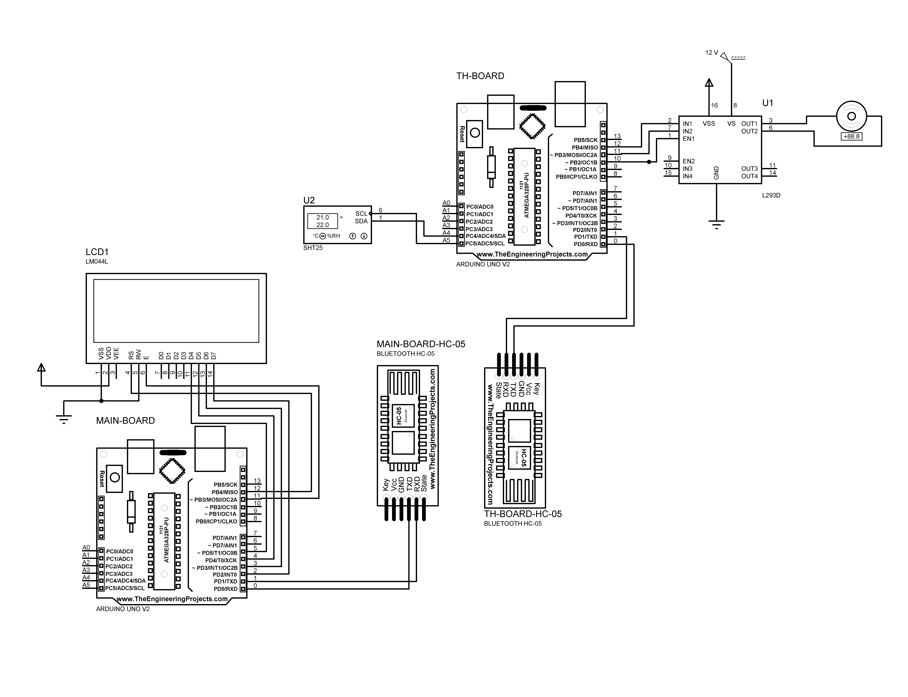
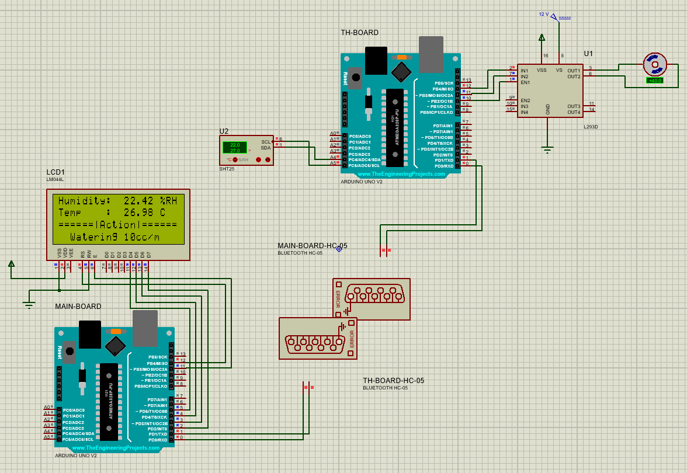
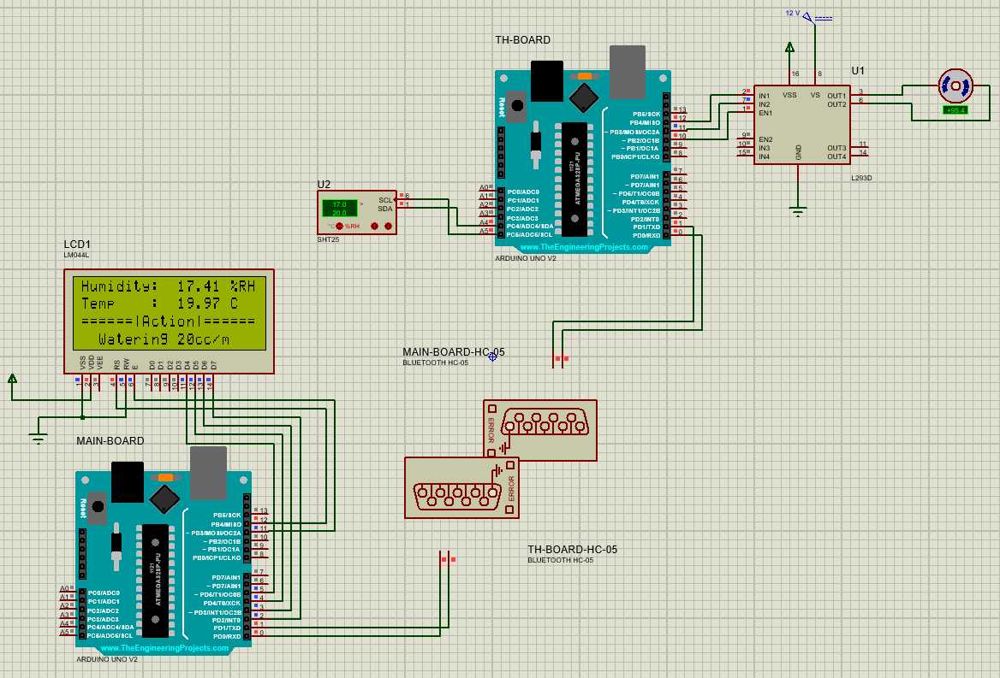

# Smart Goldan

A smart flowerpot which controls irrigation based on temperature and humidity, implemented with Arduino.

## Diagram

## Proteus Simulation Screenshots

No irrigation:

10 cc/minute irrigation:

20 cc/minute irrigation:

